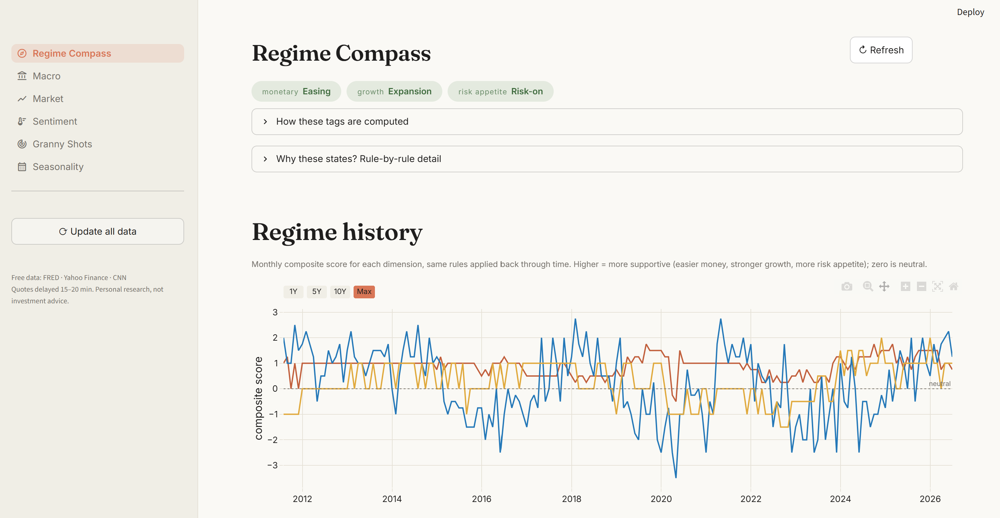
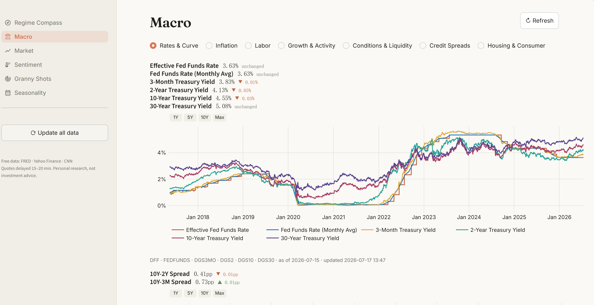

# Lodestar
> Self-hosted macro & equity research dashboard in pure Python — regime, market
> internals, sentiment, seasonality & thematic stock screening.





A self-hosted macro + equity dashboard: real-time market internals layered on official historical macro series, a rule-based regime state machine, a contrarian sentiment thermometer, S&P 500 seasonality, and a Granny Shots multi-theme stock cross-section engine. Pure Python, free data sources only.

## Quick start

**Double-click `Start Lodestar.bat`.**

- First run: creates a local virtual environment and installs dependencies
  (a few minutes), then opens the dashboard in your browser.
- Every run after that: opens in seconds.
- Requires Python 3.11+ on the machine (https://python.org). No API keys.

The first visit to each page downloads its data (FRED history can take
~30 seconds); everything after that is served from the local cache.

## Pages

| Page | What it answers |
|---|---|
| **Regime Compass** | Where are we in the cycle? Three regime pills (monetary / growth / risk), a one-line playbook, market snapshot, key macro prints. |
| **Macro** | Full-history official series: rates & curve, inflation, labor, growth, financial conditions & liquidity, credit, housing & consumer. |
| **Market** | Indices, volatility, sector rotation heatmap, style/factor relative strength, commodities, dollar, bonds. |
| **Sentiment** | VIX + CNN Fear & Greed|
| **Granny Shots** | 7 themes vote on a curated universe; names hit by ≥2 themes form an equal-weight portfolio, rebalanced quarterly. Hit matrix, sector split, theme overlap, CSV export. |
| **Seasonality** | Monthly / weekday / presidential-cycle patterns from ~100 years of S&P 500 history, with today's calendar position highlighted. |

## Data architecture

```
source (FRED / Yahoo / CNN)
   │ retry ×3
   ▼
SQLite cache  data/cache.db  (single portable file)
   │ TTL per source: intraday 15 min · FRED daily 12 h · weekly/monthly 24 h · sentiment 6 h
   ▼
page render  (a dead source falls back to the last cached copy,
              flagged "cached" instead of crashing the page)
```

- **FRED** is fetched through the official key-less `fredgraph.csv` endpoint —
  no registration needed.
- **Yahoo Finance / CNN** are best-effort sources: every call is
  wrapped in retry + cache fallback. If one source is down the sentiment
  thermometer automatically reweights around it.

### Updating data

- **Whole app**: the sidebar's `⟳ Update all data` button force-refreshes
  every source (FRED, market history, sentiment) with a progress bar,
  ~1 minute.
- **Single page**: every page's `↻ Refresh` button re-pulls just that page's
  data.
- **Headless / scheduled** (optional): `scripts/update_data.py` runs the same
  refresh from the command line, e.g. for Windows Task Scheduler.
- **Reset**: delete `data/cache.db`; it is rebuilt on the next launch.

## Configuration (no code required)

| File | Controls |
|---|---|
| `config/series.yaml` | Which FRED series appear, their labels, units, YoY/level transform, cache TTL. Add a line → new chart on the Macro page. |
| `config/themes.yaml` | Granny Shots theme constituents, sector pools, rebalance months. Edit lists → hit `↻ Refresh`. |
| `config/thresholds.yaml` | Regime rule thresholds (NFCI, VIX, HY OAS, GDPNow bands) and sentiment weights. |

## Project layout

```
lodestar/
├── app.py                  # entry point + navigation + "Update all data"
├── Start Lodestar.bat      # double-click launcher
├── views/                  # one file per page
├── core/                   # data + logic layer
│   ├── cache.py            # SQLite three-stage cache (read → fetch → fallback)
│   ├── fred.py             # FRED fetcher + series registry
│   ├── market.py           # yfinance fetcher with retry/fallback
│   ├── sentiment.py        # VIX / Fear & Greed + thermometer
│   ├── regime.py           # rule-based regime state machine
│   ├── granny.py           # theme cross-section engine
│   ├── seasonality.py      # S&P 500 seasonal statistics
│   └── refresh.py          # full-refresh job list (in-app update button)
├── config/                 # user-editable YAML (series, themes, thresholds)
├── ui/                     # design system: theme, components, chart builders
└── data/                   # SQLite cache (auto-created, safe to delete)
```

## Notes & limits

- Quotes are delayed 15–20 minutes; this is a research dashboard, not an
  execution tool. Nothing here is investment advice.
- All thresholds and theme lists are opinions encoded in YAML — tune them.
- Roadmap ideas: 13F-based theme discovery, Granny Shots backtest vs SPY,
  regime → sector playbook mapping, weekly email/Telegram digest.
